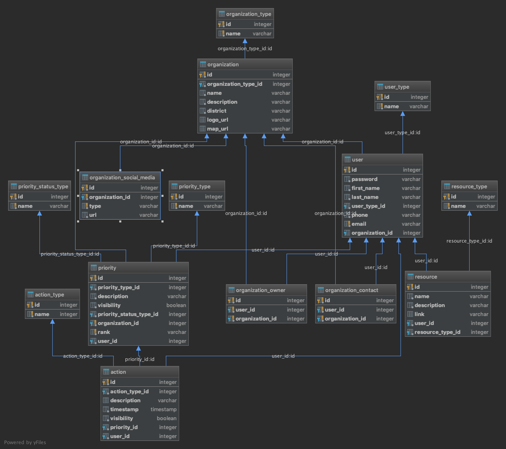

# neighborhood-connect-api

API and backend for the Neighborhood Connect project

## Table of Contents

- [Database Tables](#database-tables)
  - [Schema](#schema)
  - [User](#user)
  - [User_Type](#user_type)
  - [Organization_Contact](#organization_contact)
  - [Organization_Owner](#organization_owner)
- [Endpoints](#endpoints)
  - [`/orgs/:org_id/users`](#/orgs/:org_id/users)
  - [`/orgs/:org_id/users/:user_id`](#/orgs/:org_id/users/:user_id)
  - [`/orgs/`](#/orgs/)
  - [`/orgs/:org_id/`](#/orgs/:org_id/)
  - [`/org/priorities`](#/org/priorities)
  - [`/org/:org_id/priorities`](#/org/:org_id/priorities)
  - [`/org/:org_id/priorities/:priorities_id`](#/org/:org_id/priorities/:priorities_id)

# Database Tables

## Schema



## User

| Name            | Type    | Details |
| --------------- | ------- | ------- |
| id              | int     | PK      |
| password        | int     |         |
| first_name      | varchar |         |
| last_name       | varchar |         |
| user_type_id    | int     | FK      |
| phone           | varchar |         |
| email           | varchar |         |
| organization_id | varchar | FK      |

## user_type

| Name | Type    | Details |
| ---- | ------- | ------- |
| id   | int     | PK      |
| name | varchar |         |

## organization_contact

| Name            | Type    | Details |
| --------------- | ------- | ------- |
| id              | int     | PK      |
| user_id         | int     | FK      |
| organization_id | varchar | FK      |

## organization_owner

| Name            | Type    | Details |
| --------------- | ------- | ------- |
| id              | int     | PK      |
| user_id         | int     | FK      |
| organization_id | varchar | FK      |

[Back to table of Contents](#table-of-contents)

# Endpoints

### Users

| Endpoint                       | METHOD | Description |
| ------------------------------ | ------ | ----------- |
| `/orgs/:org_id/users`          | POST   |             |
| `/orgs/:org_id/users/:user_id` | PATCH  |             |
| `/orgs/:org_id/users/:user_id` | GET    |             |
| `/orgs/:org_id/users/:user_id` | UPDATE |             |
| `/orgs/:org_id/users/:user_id` | DELETE |             |

### Org

| Endpoint         | METHOD | Description |
| ---------------- | ------ | ----------- |
| `/orgs/`         | GET    |             |
| `/orgs/:org_id/` | GET    |             |
| `/orgs/:org_id/` | PATCH  |             |

### Priorities

| Endpoint                                 | METHOD | Description |
| ---------------------------------------- | ------ | ----------- |
| `/org/priorities/`                       | GET    |             |
| `/org/:org_id/priorities`                | GET    |             |
| `/org/:org_id/priorities/:priorities_id` | GET    |             |

# Data requests and responses

Below are all expected request body shapes and data responses

## `/orgs/:org_id/users`

**Method:** POST

Structure of request

```
{

}
```

**HTTP Status:**

Structure of response:

```
{

}
```

## `/orgs/:org_id/users/:user_id`

**Method:** PATCH

Structure of request

```
{

}
```

**HTTP Status:**

Structure of response:

```
{

}
```

---

**Method:** GET

Structure of request

```
{

}
```

**HTTP Status:**

Structure of response:

```
{

}
```

---

**Method:** UPDATE

Structure of request

```
{

}
```

**HTTP Status:**

Structure of response:

```
{

}
```

---

**Method:** DELETE

Structure of request

```
{

}
```

**HTTP Status:**

Structure of response:

```
{

}
```

## `/orgs/`

**Method:** GET

Structure of request

```
{

}
```

**HTTP Status:**

Structure of response:

```
{

}
```

## `/orgs/:org_id/`

**Method:** GET

Structure of request

```
{

}
```

**HTTP Status:**

Structure of response:

```
{

}
```

---

**Method:** PATH

Structure of request

```
{

}
```

**HTTP Status:**

Structure of response:

```
{

}
```

## `/orgs/priorities/`

**Method:** GET

Structure of request

```
{

}
```

**HTTP Status:**

Structure of response:

```
{

}
```

## `/orgs/:org_id/priorities`

**Method:** GET

Structure of request

```
{

}
```

**HTTP Status:**

Structure of response:

```
{

}
```

## `/orgs/:org_id/priorities/:priorities_id`

**Method:** GET

Structure of request

```
{

}
```

**HTTP Status:**

Structure of response:

```
{

}
```

[Back to table of Contents](#table-of-contents)

      /priorities/org/:org_id       -- returns a list of priorities for this organization
      /priorities/district/:district_id    -- returns sorted list of priorities for all orgs in that district .
      /priorities/type/:type_id  -- returns sorted list of priorities which have this type .  Can be combined with org or district forms
      /priorities/org/42/type/77  -- returns sorted list of priorities for organization 42 which have type 77

actions:

CRUD for:

- priority
- priority type
- priority level
- user
- organization
- organization type
- event
